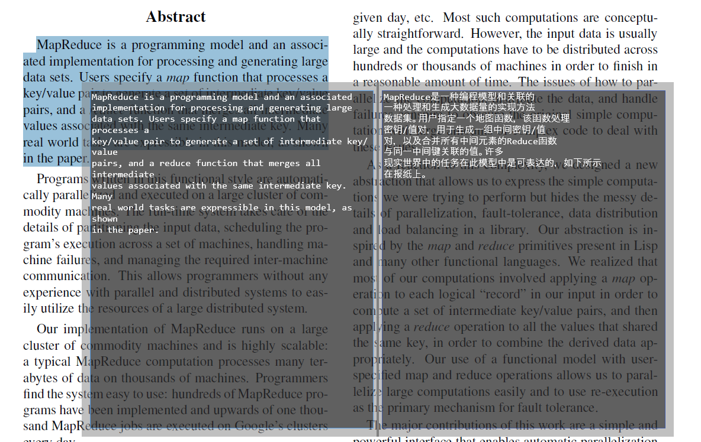
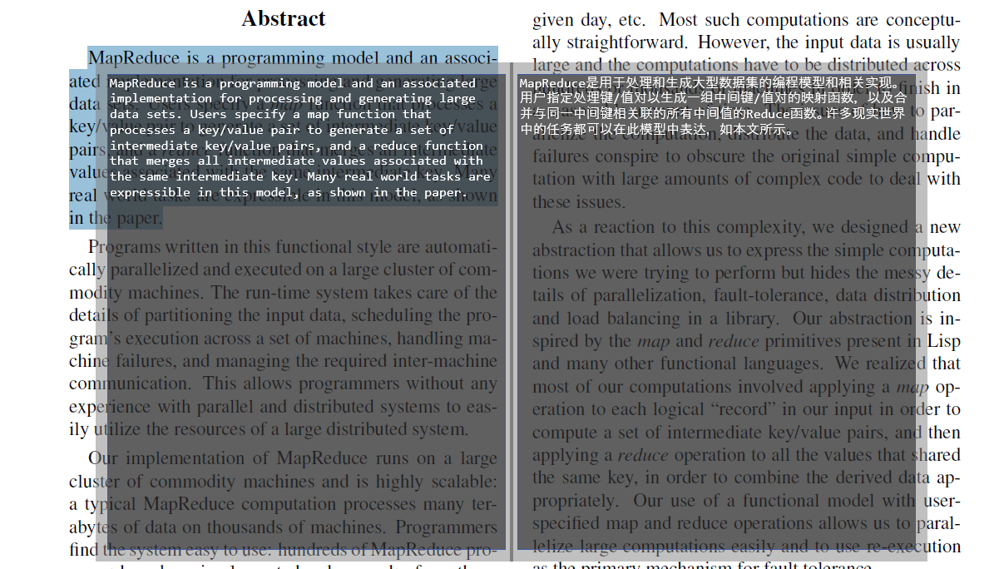
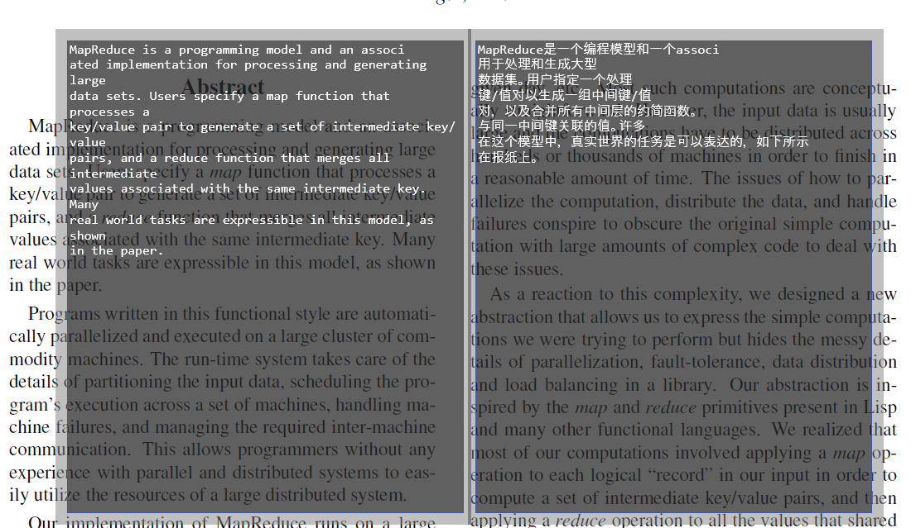
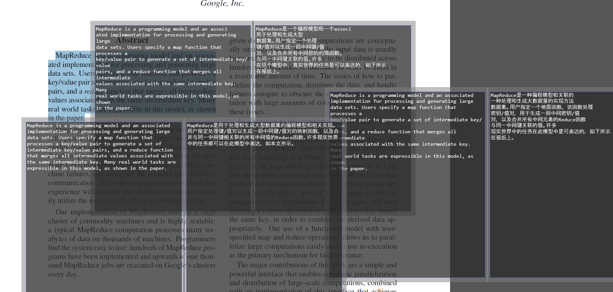
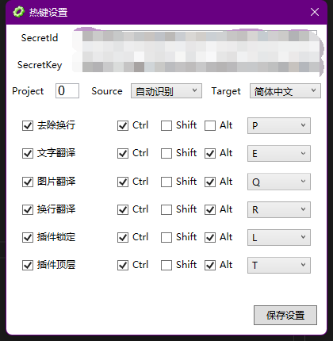
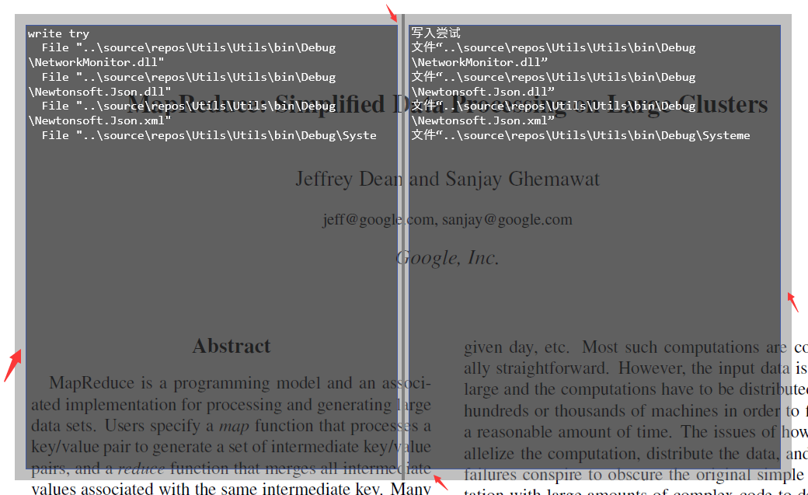

# 介绍

NetMoniter是一款集成翻译、图片识别功能的网速插件。

- 文献翻译功能，能读取剪切板内容并将其进行翻译
- 多行合并功能，能读取剪切板内容并把多行进行合并，特别适合阅读PDF格式的论文
- 图片翻译功能，具有识别图片内容并进行翻译的功能
- 网速显示功能，能实时显示当前计算机所有网卡的网速之和

# 展示
### 网速展示
非常小巧的一款插件

### 文献翻译

### 多行合并翻译

### 图片识别

### 开启多个
理论上可以开启无限多个翻译窗口

# 使用方法

1.下载setup.exe并安装

2.打开腾讯云（基于腾讯翻译），注册账号，并在设置中填写信息。（https://console.cloud.tencent.com/cam/capi）

3.按照配置的快捷键即可使用。如果复制的是文字，而使用图片翻译，则无返回结果（其他情况相同）。

4.打开的翻译窗口，可以双击空白处或按esc关闭。（空白处为箭头所指向的浅灰色）

